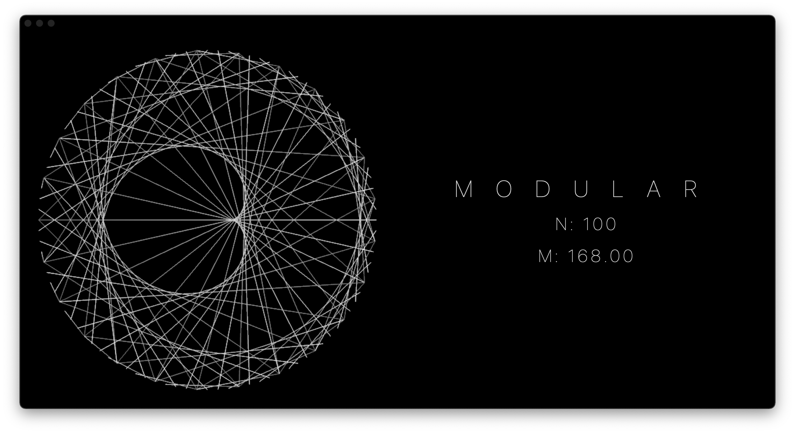

# ModularMTL

### Description

Modular multiplication on a circle visualiser.  
Written in **Swift** using **Metal API** and **SwiftUI**.

### Images

### Features
- [x] Basic UI
- [ ] User keyboard controls,
- [x] Calculations offloaded to Compute shaders,
- [x] Managed using Swift Packages with separate local Core module containing complete rendering logic. 

### Building
- Clone the repository,
- Use `swift build -c release --arch arm64 --arch x86_64` inside your local repository clone to build universal binary in release configuration,

### Running
*WIP*
