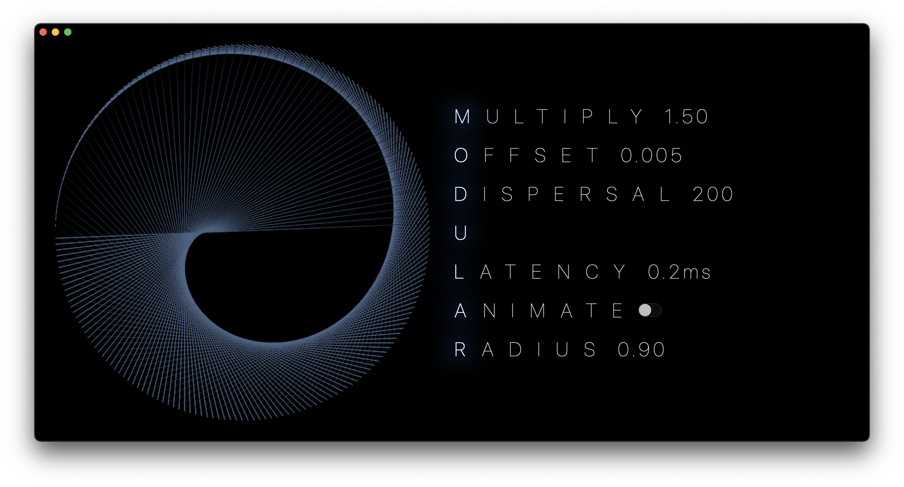

# ModularMTL

## About
Modular multiplication on a circle, is a beautiful way to visualise interesting patterns, emerging from basic operation of multiplication. The inspiration for this visualization came from [Times Tables, Mandelbrot and the Heart of Mathematics](https://youtu.be/qhbuKbxJsk8) YouTube video by _Mathologer_.  

Written in **Swift** using **Metal API** and **SwiftUI**.

## Images


## Algorithm
The operating scheme is very simple:
- Distribute _**N**_ points on the circle equally,
- Select a multiplier _**M**_
- For each point **_n_**:
  - Perform modulo _**N**_ operation on a product between index of point _**n**_ and multiplier _**M**_
  - The result of the above operation becomes the index of the endpoint _**e**_
  - Create a connection between points _**n**_ and _**e**_

Computation of connections is offloaded to Compute Shaders, written using Metal Shading Language.


## Features
- Animation mode,
- Parameter controls using arrow keys,
- Glow effect on supported hardware (Metal Performance Shaders),
- Managed using Swift Package Manager with separate _Core_ module. 

## Building
Binary must be bundled together with Core bundle containing default Metal library (`.metallib` file).  
The easiest way to do that, is using [swift-bundler](https://github.com/stackotter/swift-bundler) tool.  

Once set up, it can create application bundle with proper structure and Metal library included in Core bundle.

```sh
git clone https://github.com/JezewskiG/ModularMTL
cd ModularMTL

# Build Universal binary in Release configuration. 
# Application bundle will be created in your current directory.
swift-bundler build -c release -o . -u
```

*Universal application bundle available in releases.*
